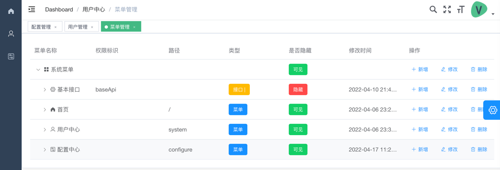
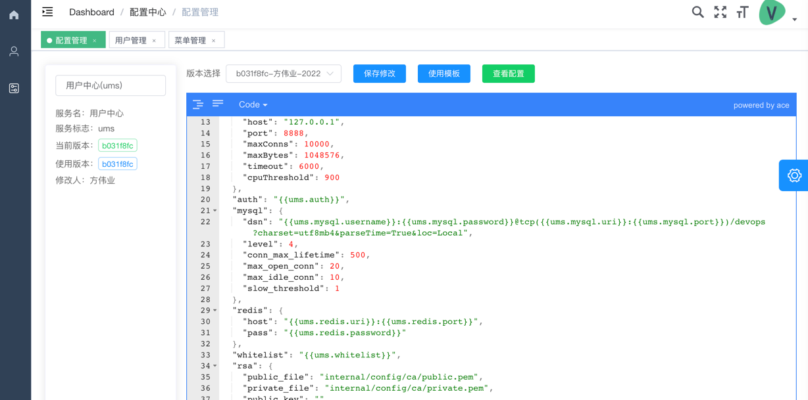
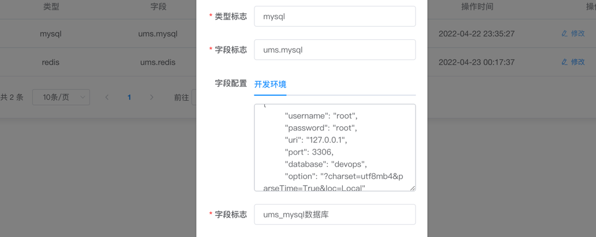
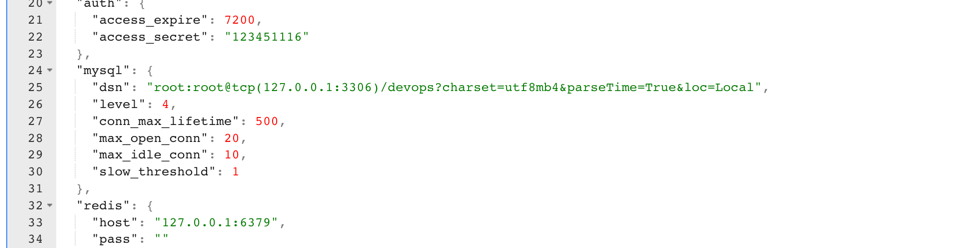
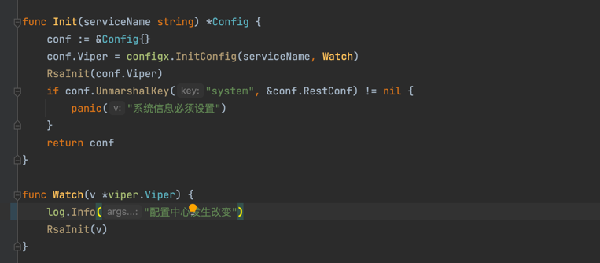

# devops 运维云
### 管理端连接 https://github.com/limeschool/devops
### 绪论
最近自己在写一些小项目练手，经常会遇到有一些配置时常想修改，写到数据库又感觉大可不必，使用常规的模板配置比如consul\etcd时又觉得缺少多环境的控制，在本地和线上的调试修改相对于稍微比较麻烦了一些。其实在我们开发的时候，本地和线上或者线上也有多个环境的情况下，我们希望实现的是同一个配置模板，对于每一个环境来说其中的某一些配置值是不一样的。那么其实我们可以直接将多个环境配置不同的key然后直接修改其中需要修改的值这样也是可以实现的，但是随着时间日积月累，开始逐渐有新的字段需要添加，这意味着你需要同时更新全部环境的字段，否则就会出现不同环境字段不一致，难以管理。这想来肯定是一件非常恶心的事儿。所以就趁下班的时间，肝了几天，写了这套运维云。

目前实现了用户中心，配置中心，后续还想继续添加新的东西进来，组成一个强大的运维管理平台。但是由于我本身也是一个菜鸟，估计这得要很长的时间。不过配置这一块能够解决，这也是解决了一些问题。

### nginx 配置
```
server {
        listen        80;
        server_name  y.cn;
        root   "/Applications/phpstudy/WWW/y.cn";
		
		location /api/auth {
			fastcgi_intercept_errors on;
			proxy_pass_request_body     off;
			if ($request_method = 'OPTIONS') {
			    return 204;
			}
			proxy_set_header X-Original-URI $request_uri;
			proxy_set_header X-Original-METHOD $request_method;
			proxy_set_header X-Real-IP $remote_addr;
			proxy_set_header X-Forwarded-For $proxy_add_x_forwarded_for;
			proxy_set_header X-Forwarded-Proto $scheme;
			proxy_pass http://127.0.0.1:8888/api/v1/ums/auth/validate;
		}
		
		location /api/v1/ums {
			auth_request /api/auth;
			auth_request_set $user $upstream_http_x_user;
			error_page 401 = @error401;
			error_page 403 = @error403;
			error_page 500 = @error500;
			proxy_set_header X-User $user;
			proxy_set_header Host $http_host;
			proxy_set_header X-Real-IP $remote_addr;
			proxy_set_header REMOTE-HOST $remote_addr;
			proxy_set_header X-Forwarded-For $proxy_add_x_forwarded_for;
		    proxy_pass http://127.0.0.1:8888;
		}
		
		location /api/v1/cms {
			auth_request /api/auth;
			auth_request_set $user $upstream_http_x_user;
			error_page 401 = @error401;
			error_page 403 = @error403;
			error_page 500 = @error500;
			proxy_set_header X-User $user;
			proxy_set_header Host $http_host;
			proxy_set_header X-Real-IP $remote_addr;
			proxy_set_header REMOTE-HOST $remote_addr;
			proxy_set_header X-Forwarded-For $proxy_add_x_forwarded_for;
		    proxy_pass http://127.0.0.1:8887;
		}
		
		location @error401{
			add_header Access-Control-Allow-Origin *;
			add_header Content-Type application/json;
			return 200 '{"code":401,"msg":"token验证失败，请进行登陆"}';
		}
		
		location @error403{
			add_header Access-Control-Allow-Origin *;
			add_header Content-Type application/json;
			return 200 '{"code":403,"msg":"暂无此接口资源权限"}';
		}
		
		location @error500{
			add_header Access-Control-Allow-Origin *;
			add_header Content-Type application/json;
			return 200 '{"code":500,"msg":"服务器内部错误"}';
		}
}

```
### 功能规划

#### user 用户中心
##### 关键词： RBAC权限管理、指令控制、API决策
用户中心是系统用户管理的。使用RBAC角色管理，可自由配置动态菜单，实现API请求管理决策。



#### configure 配置中心
##### 多环境、多服务、多适配、版本控制、实时更新、字段变量

配置中心是一个实现我们开发中配置线上化的一个功能，免去了本地修改配置需要修改文件的麻烦。目前兼容etcd 和 consul。你可以使用配置中心快速进行项目开发。配置中心具有多服务多环境的功能，可针对不同的环境开发时，只需要管理一套模板即可。

配置中心支持模板变量解析。我们的配置文件中，往往会出现一些敏感信息，但是哪些敏感信息我们需要对开发某些人员进行屏蔽，比如开发人员只能查看开发的数据库信息，而不能查看生产的配置信息。再或者我们有一个白名单的控制，我们需要经常向配置中的某一个字段进行写入，且每个人环境的白名单会出现不同时，那么这种时候模板变量就派上了用场。

可以看到配置中心的第一张图，我们的数据库信息是使用的模板变量，我们需要进行配置，配置的值如上图，最后解析的模板变量如下图

好了，讲完配置中心的功能之后，我们开发中如何使用呢，在本项目中，用户中心就是使用配置中心进行配置管理的。我们来看看这到底有多简单

如图，我们只需要实现一个Init 函数来初始化配置即可。configx中已经实现了配置的连接获取等。而且提供了watch 开发者可以轻松实现配置变化监听。
但是在启动前我们需要简单的设置一下环境变量。
```
export CONFIG_ADDR=http://localhost:8887 # 配置中心地址
export ENV=DEV # 当前环境
```


#### 告警中心

